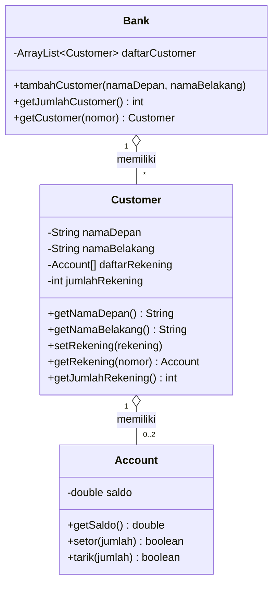
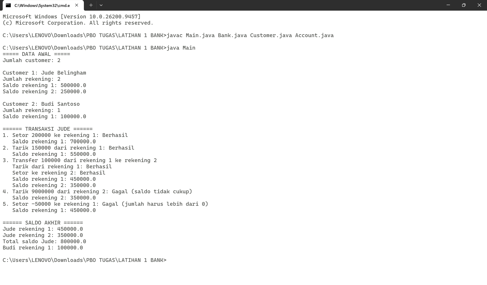
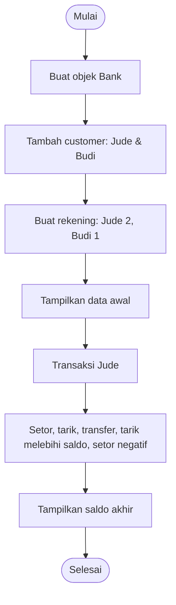

<div align="center">

# 🏦 Java OOP Banking System Simulation

**Simulasi sistem perbankan sederhana berbasis Object-Oriented Programming (OOP)**
**dengan implementasi struktur data `Array` dan `ArrayList`**


</div>

---

## 🧠 Sekilas tentang PBO

**Pemrograman Berorientasi Objek (PBO / OOP)** adalah cara menyusun program dengan memodelkan hal-hal di dunia nyata sebagai **objek**. Setiap objek punya **atribut** (data) dan **method** (perilaku). Dengan cara ini, kode menjadi lebih rapi, mudah dipakai ulang, dan mudah dikembangkan.

Di proyek ini, dunia perbankan dimodelkan menjadi tiga objek utama: **Bank**, **Customer**, dan **Account**.

---

## 📑 Daftar Isi

1. [📖 Tentang Proyek](#-tentang-proyek)
2. [✨ Fitur Utama](#-fitur-utama)
3. [📂 Struktur Proyek & Komponen Kelas](#-struktur-proyek--komponen-kelas)
4. [🧩 Diagram Relasi Kelas](#-diagram-relasi-kelas)
5. [🎓 Konsep OOP yang Diterapkan](#-konsep-oop-yang-diterapkan)
6. [🛠️ Cara Menjalankan Program](#️-cara-menjalankan-program)
7. [💻 Hasil Eksekusi Program](#-hasil-eksekusi-program)
8. [🔄 Alur Simulasi](#-alur-simulasi)
9. [🚀 Implementasi Array & ArrayList](#-implementasi-struktur-data)
10. [👤 Identitas Pengguna](#-identitas-pengguna)

---

## 📖 Tentang Proyek

Repository ini dikembangkan untuk **mempelajari dan mendemonstrasikan konsep dasar Pemrograman Berorientasi Objek (PBO) di Java**.

Sistem ini mensimulasikan operasional perbankan sederhana:

> 🏦 **Bank** dapat mengelola banyak **Customer** (nasabah),
> 👤 dan setiap **Customer** dapat memiliki beberapa **Account** (rekening bank).

Konsep OOP yang diterapkan antara lain **class & object**, **encapsulation** (atribut `private` + getter), **constructor**, serta **relasi antar kelas** (*has-a / composition*).

---

## ✨ Fitur Utama

| Fitur | Keterangan |
| :--- | :--- |
| ➕ Tambah nasabah | Bank dapat menambah customer baru secara dinamis |
| 💳 Kelola rekening | Satu customer dapat memiliki maksimal **2 rekening** |
| 💰 Setor (deposit) | Hanya berhasil jika jumlah **lebih dari 0** |
| 🏧 Tarik (withdraw) | Hanya berhasil jika **saldo mencukupi** |
| 🔁 Transfer | Tarik dari satu rekening, lalu setor ke rekening lain |
| ✅ Validasi | Transaksi tidak valid akan ditolak (`Gagal`) |

---

## 📂 Struktur Kelas

```text
 ┣ 📜 Account.java     → Saldo rekening, setor() & tarik()
 ┣ 📜 Customer.java    → Data nasabah + daftar rekening (Array)
 ┣ 📜 Bank.java        → Kumpulan nasabah (ArrayList)
 ┣ 📜 Main.java        → Kelas utama (driver program)
```
---

## 🧩 Diagram Relasi Kelas



---

## 🎓 Konsep OOP yang Diterapkan

| Konsep | Penerapan di Proyek |
| :--- | :--- |
| 🧱 **Class & Object** | `Bank`, `Customer`, `Account` dibuat objeknya di `Main` memakai `new` |
| 🔒 **Encapsulation** | Atribut dibuat `private` (misal `saldo`), diakses lewat method seperti `getSaldo()` |
| 🏗️ **Constructor** | `Account(double saldo)`, `Customer(namaDepan, namaBelakang)`, `Bank()` |
| 👉 **Keyword `this`** | Dipakai untuk membedakan atribut objek dengan parameter |
| 🔗 **Relasi antar kelas (has-a)** | Bank punya Customer, Customer punya Account |
| ✔️ **Validasi di method** | `setor()` dan `tarik()` mengembalikan `boolean` sebagai tanda berhasil/gagal |

---

## 🛠️ Cara Menjalankan Program

**Prasyarat:** sudah menginstal **JDK (Java Development Kit)**. Cek dengan perintah `java -version`.

**1️⃣ Buka Command Prompt** di folder proyek.

**2️⃣ Compile semua file:**

```bash
javac Main.java Bank.java Customer.java Account.java
```

**3️⃣ Jalankan program:**

```bash
java Main
```

---

## 💻 Hasil Eksekusi Program

Berikut adalah hasil tangkapan layar (*screenshot*) saat program dijalankan melalui Command Prompt:

<div align="center">



*Gambar: Output program saat dijalankan di Command Prompt*

</div>

<details>
<summary>📋 <b>Klik untuk melihat output dalam bentuk teks</b></summary>

```text
===== DATA AWAL =====
Jumlah customer: 2

Customer 1: Jude Belingham
Jumlah rekening: 2
Saldo rekening 1: 500000.0
Saldo rekening 2: 250000.0

Customer 2: Budi Santoso
Jumlah rekening: 1
Saldo rekening 1: 100000.0

====== TRANSAKSI JUDE ======
1. Setor 200000 ke rekening 1: Berhasil
   Saldo rekening 1: 700000.0
2. Tarik 150000 dari rekening 1: Berhasil
   Saldo rekening 1: 550000.0
3. Transfer 100000 dari rekening 1 ke rekening 2
   Tarik dari rekening 1: Berhasil
   Setor ke rekening 2: Berhasil
   Saldo rekening 1: 450000.0
   Saldo rekening 2: 350000.0
4. Tarik 9000000 dari rekening 2: Gagal (saldo tidak cukup)
   Saldo rekening 2: 350000.0
5. Setor -50000 ke rekening 1: Gagal (jumlah harus lebih dari 0)
   Saldo rekening 1: 450000.0

====== SALDO AKHIR ======
Jude rekening 1: 450000.0
Jude rekening 2: 350000.0
Total saldo Jude: 800000.0
Budi rekening 1: 100000.0
```

</details>

---

## 🔄 Alur Simulasi



| No | Skenario | Hasil | Saldo Setelahnya |
| :-: | :--- | :-: | :--- |
| 1 | Setor Rp200.000 ke rekening 1 | ✅ Berhasil | Rek. 1 = 700.000 |
| 2 | Tarik Rp150.000 dari rekening 1 | ✅ Berhasil | Rek. 1 = 550.000 |
| 3 | Transfer Rp100.000 rekening 1 → rekening 2 | ✅ Berhasil | Rek. 1 = 450.000, Rek. 2 = 350.000 |
| 4 | Tarik Rp9.000.000 dari rekening 2 (melebihi saldo) | ❌ Gagal | Rek. 2 = 350.000 |
| 5 | Setor −Rp50.000 ke rekening 1 (jumlah negatif) | ❌ Gagal | Rek. 1 = 450.000 |

---

## 🚀 Implementasi Struktur Data

Dalam pengembangan proyek ini, digunakan **dua pendekatan struktur data** yang berbeda untuk kebutuhan penyimpanan koleksi objek.

### 1. Implementasi Array 

📍 **Digunakan pada:** `Customer.java`

Array statis digunakan ketika **kapasitas maksimum elemen sudah ditentukan sejak awal**. Pada kelas `Customer`, setiap nasabah dibatasi hanya dapat memiliki **maksimal 2 rekening** (`Account[] daftarRekening = new Account[2];`).

```java
private Account[] daftarRekening = new Account[2];
private int jumlahRekening = 0;

public void setRekening(Account rekening) {
    if (this.jumlahRekening < this.daftarRekening.length) {
        this.daftarRekening[this.jumlahRekening] = rekening;
        this.jumlahRekening++;
    }
}
```

> 💡 **Karakteristik:** Ukuran memori tetap dan efisien jika batas maksimal data sudah pasti (pasti ada 2 slot rekening).

### 2. Implementasi ArrayList 

📍 **Digunakan pada:** `Bank.java`

`ArrayList` (`java.util.ArrayList`) digunakan ketika **jumlah data dapat bertambah atau berkurang secara fleksibel** tanpa batasan ukuran awal yang kaku. Pada kelas `Bank`, kumpulan data customer dikelola menggunakan `ArrayList<Customer>`:

```java
private ArrayList<Customer> daftarCustomer;

public Bank() {
    this.daftarCustomer = new ArrayList<>();
}

public void tambahCustomer(String namaDepan, String namaBelakang) {
    this.daftarCustomer.add(new Customer(namaDepan, namaBelakang));
}
```

> 💡 **Karakteristik:** Fleksibel karena ukuran otomatis menyesuaikan saat data baru ditambahkan menggunakan `.add()`, diambil dengan `.get(index)`, atau dicek totalnya dengan `.size()`.

### 📊 Perbandingan Array vs ArrayList

| Aspek | Array (`Account[]`) | ArrayList (`ArrayList<Customer>`) |
| :--- | :--- | :--- |
| Ukuran | Tetap (2 elemen) | Dinamis, otomatis bertambah |
| Tambah data | Manual lewat indeks + penghitung | `.add()` |
| Ambil data | `array[indeks]` | `.get(indeks)` |
| Jumlah data | Variabel penghitung (`jumlahRekening`) | `.size()` |
| Cocok untuk | Jumlah data sudah pasti | Jumlah data tidak pasti |

---

## 👤 Identitas Pembuat

| | |
| :--- | :--- |
| 🧑 **Nama** | `Asmaul Husnah` |
| 🆔 **NIM** | `F1D02510106` |
| 🏫 **Kelas** | `B` |
| 📚 **Mata Kuliah** | Pemrograman Berorientasi Objek (PBO) |

---

<div align="center">


</div>
